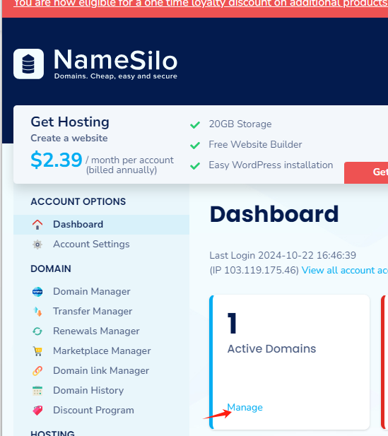
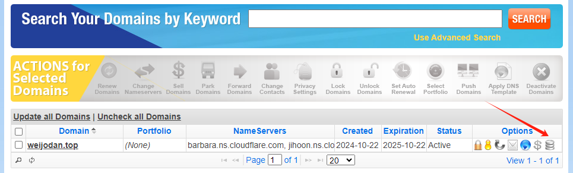
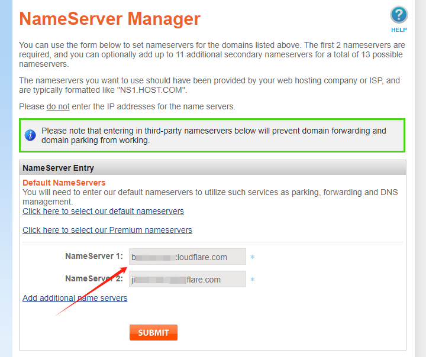
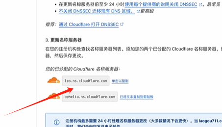
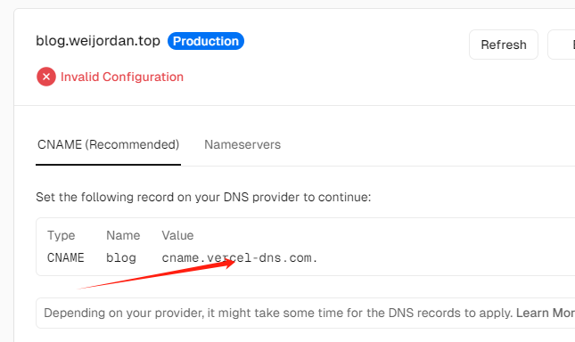
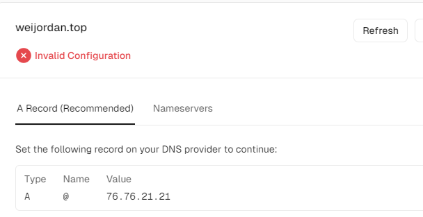
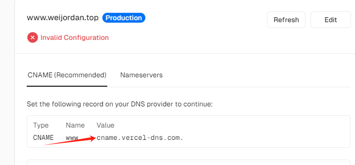
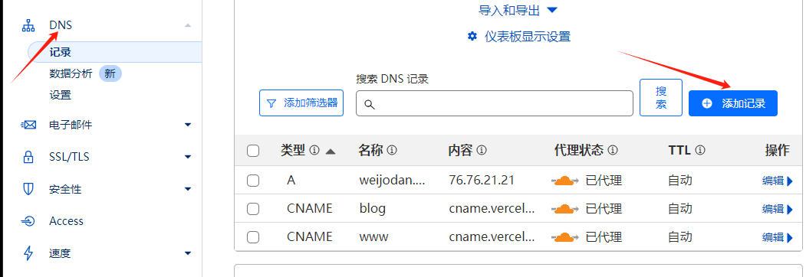

<h2 id="fs6Yu">总结</h2>
<h3 id="YW1Vw">域名购买,域名绑定和解析,项目绑定自定义域名教程</h3>
1.[namesilo](https://www.namesilo.com/account/) 购买一个一级域名

2.namesilo管理界面点击 manage

点击域名绑定

填写cloudflare给的DNS

3.打开 [cloudflare](https://dash.cloudflare.com/) 在概述里面填写买的域名 然后将两个名称服务器填写到你购买的域名管理里面进行替换

4.在 [vercerl](https://vercel.com/) 部署项目以后 将domain填写成你的域名,你可以填写前缀变成一个二级域名使用,如我的是 weijordan.top,那我将设成blog.weijordan.top,将

三个填入 [cloudflare](https://dash.cloudflare.com/) 的DNS 管理里面 

然后刷新vercel,等待DNS解析,如果暂时没反应,等待24小时左右

---

<h2 id="OayU7">视频教程</h2>
[https://www.bilibili.com/video/BV1mu4y1t7Vm/?spm_id_from=333.337.search-card.all.click&vd_source=ac6ab4c3cdc5d0193edf55fd77ba0b4f](https://www.bilibili.com/video/BV1mu4y1t7Vm/?spm_id_from=333.337.search-card.all.click&vd_source=ac6ab4c3cdc5d0193edf55fd77ba0b4f)

[https://www.bilibili.com/video/BV1NeeVeoEid?spm_id_from=333.788.player.switch&vd_source=ac6ab4c3cdc5d0193edf55fd77ba0b4f](https://www.bilibili.com/video/BV1NeeVeoEid?spm_id_from=333.788.player.switch&vd_source=ac6ab4c3cdc5d0193edf55fd77ba0b4f)

[https://www.wenrui0326.top/article/loudflare-domain-dns-setup-guide](https://www.wenrui0326.top/article/loudflare-domain-dns-setup-guide)

<h2 id="yPCb5">域名管理</h2>
namesilo  
[https://www.namesilo.com/account_domains.php](https://www.namesilo.com/account_domains.php)

<h2 id="VApYu">域名解析 cloudflare</h2>
[https://dash.cloudflare.com/94e4876a7573ff5135ac1c45baa3f712/weijodan.top/dns/records](https://dash.cloudflare.com/94e4876a7573ff5135ac1c45baa3f712/weijodan.top/dns/records)

